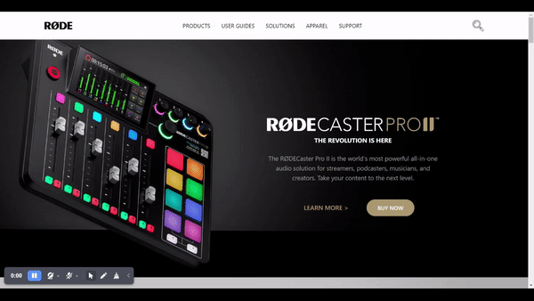
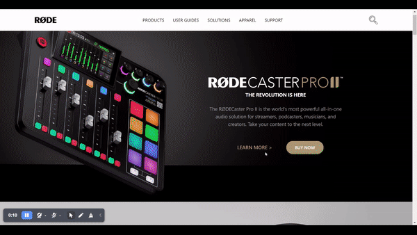
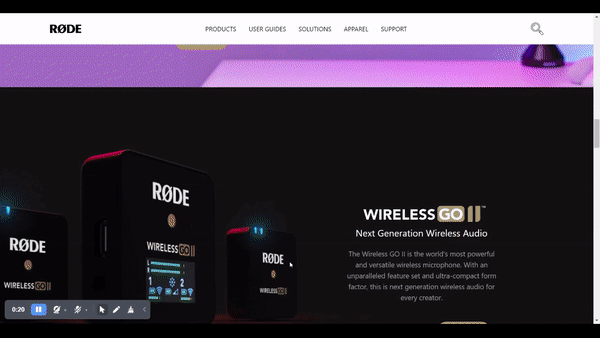
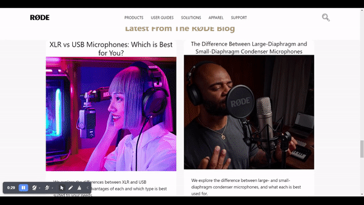

# Rode.com clone using Tailwind-CSS

---

- This project is a part of the Full Stack Javascript Web   Developer Bootcamp by iNeuron.
- This is a Clone of a popular Audio Solutions Website rode.com
- Integrated Audio Production Studio
- The world’s most powerful all-in-one audio production solution. Combining tens of thousands of dollars’ worth of studio equipment into one easy-to-use console, this is all you need to record incredible audio for any content you're creating.
- Technologies used to design the webpage

  

  

  
MOBILE RESPONSIVE

- Well `Tailwind-CSS` is the first `CSS Framework` I have ever learnt.

## Learnings

- After making two project's in `Tailwind-CSS`. I was confident on acomplishing the same for this project.
- After wrapping my head around the `navbar` I finally figured out the solution and finished building it
- I also figured out a way to align elements with a background image so that everything is visible
- I also tackled several issues but overcame all of them and finished the project
- I made the webpage over three day's time and learned a lot about the popular framework `Tailwind-CSS`
- The webpage itself was pretty lenghty and took me almost **10-12 Hours** to complete over three to four days

## Preview

## Made By Punit Bathija
